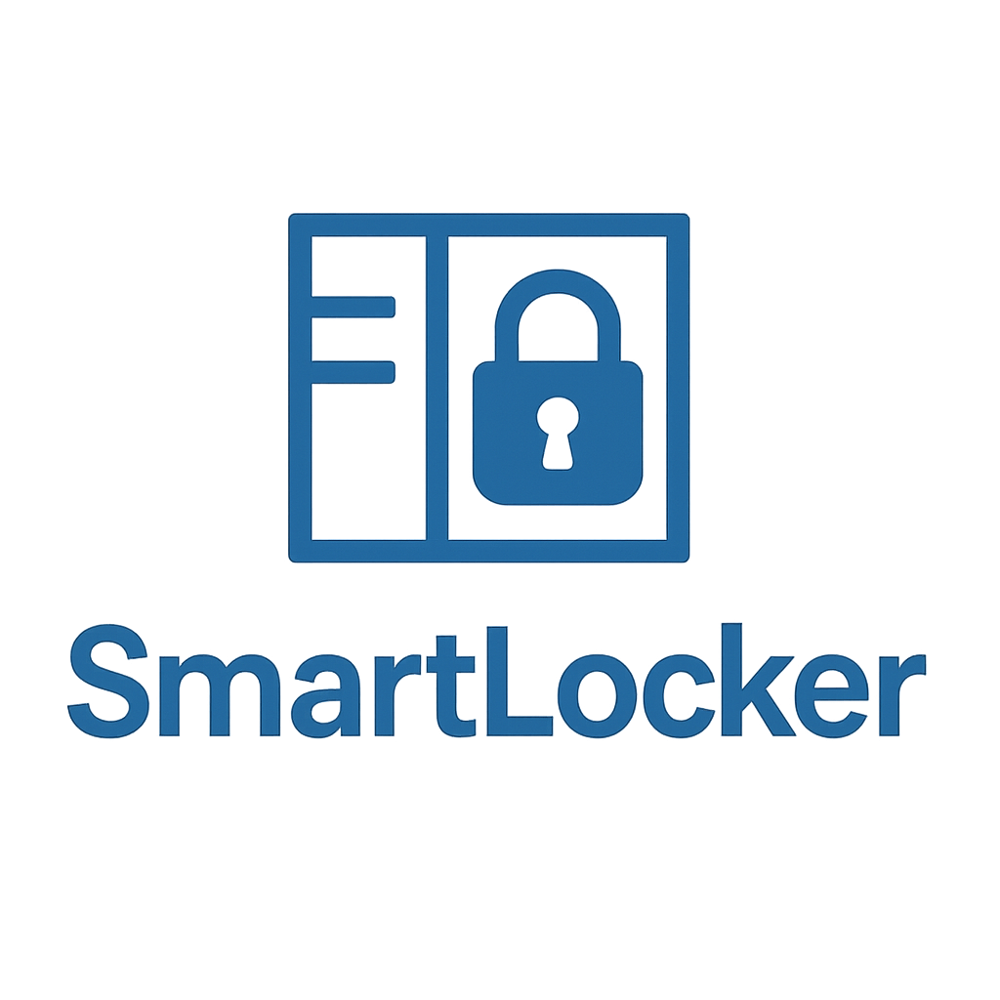

<p align="center">
  
</p>

# 🖥️ SmartLockerAppGestion – Application de Gestion

[](LICENSE)
[](https://dotnet.microsoft.com/en-us/)
[](https://github.com/quentin-reymond/smart_locker_gestion/issues)

---

## 🔎 Présentation

**SmartLockerAppGestion** est l'application de gestion du projet **SmartLocker**, conçue pour les administrateurs et opérateurs système.  
Elle permet une gestion centralisée et intuitive des utilisateurs, des casiers connectés et du suivi d'activité, pour un contrôle avancé de votre réseau de casiers intelligents.

### Fonctionnalités principales

- 👤 **Gestion des utilisateurs**  
  Ajout, modification et suppression d'utilisateurs, gestion des rôles et permissions.
- 📦 **Gestion des casiers**  
  Suivi de l'état des casiers (disponible, réservé, en maintenance), gestion des affectations et intervention à distance.
- ⏳ **Suivi des sessions**  
  Visualisation des sessions actives, historique détaillé des réservations et traitements des incidents d'ouverture/de fermeture.
- 📊 **Tableau de bord & statistiques**  
  Statistiques dynamiques, exports CSV, alertes sur utilisation anormale et indicateurs d’activité des utilisateurs.

### 🆕 Fonctionnalités prévues/Roadmap

- 🔐 Authentification renforcée (2FA)
- 🔔 Système d’alertes en temps réel (notifications mails/SMS)
- 🤖 Automatisation des rapports d’utilisation
- 🌍 Multilingue et personnalisation de l’interface
- 📱 Application mobile compagnon (prochainement)

---

## ✨ Captures d'écran


---

## ⚙️ Technologies Utilisées

| Outil/Technologie                  | Description                                      |
|-------------------------------------|--------------------------------------------------|
| **Framework**                       | WPF en .NET 9 (C#)                               |
| **Architecture**                    | MVC (Model-View-Controller), Entity Framework    |
| **API consommée**                   | SmartLockerAPI (PHP Slim + JWT)                  |
| **Base de données**                 | MySQL (via Entity Framework Core)                |
| **Design/UI**                       | Figma, V0.dev (IA design)                        |
| **Gestion de versions**             | GitHub                                           |
| **CI/CD**                           | GitHub Actions (tests, déploiement)              |

---

## 🚀 Installation & Démarrage

### Pré-requis

- [.NET 9 SDK](https://dotnet.microsoft.com/download/dotnet/9.0)
- Accès à la [SmartLockerAPI](https://github.com/quentin-reymond/SmartLockerAPI)
- MySQL server et paramètres de connexion

### Installation

```bash
# Cloner le dépôt
git clone https://github.com/quentin-reymond/smart_locker_gestion.git
cd smart_locker_gestion

# Restaurer les packages
dotnet restore

# Lancer l'application
dotnet run
```

Configurer le fichier de connexion à la base de données et l’URL de l’API dans `appsettings.json` avant de lancer.

---

## 📄 Documentation

- [Documentation technique](docs/TECH_DOC.md)
- [API Reference](https://github.com/quentin-reymond/SmartLockerAPI#readme)
- [FAQ](docs/FAQ.md)

---

## 👨‍💻 Contribuer

Les contributions sont les bienvenues !  
Merci de lire les [CONTRIBUTING.md](CONTRIBUTING.md) pour découvrir comment proposer des améliorations, signaler des bugs ou suggérer de nouvelles fonctionnalités.

1. Forkez ce dépôt
2. Créez une branche (`git checkout -b feature/ma-nouvelle-fonctionnalité`)
3. Commitez vos changements (`git commit -am 'Ajoute une nouvelle fonctionnalité'`)
4. Pushez (`git push origin feature/ma-nouvelle-fonctionnalité`)
5. Ouvrez un Pull Request

---

## 🛡️ Licence

Ce projet est distribué sous licence [MIT](LICENSE).

---

## 🙏 Remerciements

- [OpenAI Copilot](https://github.com/features/preview/copilot)
- Communauté [.NET](https://dotnet.microsoft.com/)
- [Figma](https://figma.com) et [V0.dev](https://v0.dev/)

---

<p align="center">
  <b>SmartLockerAppGestion</b> - Par <a href="https://github.com/quentin-reymond">Quentin Reymond</a>
</p>
